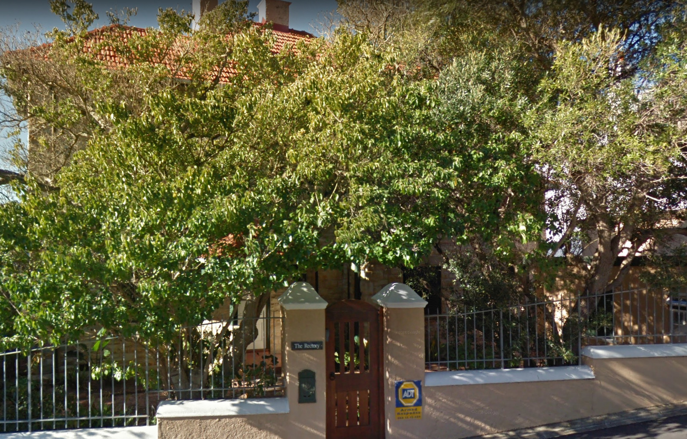
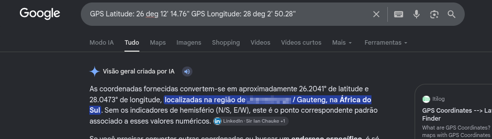
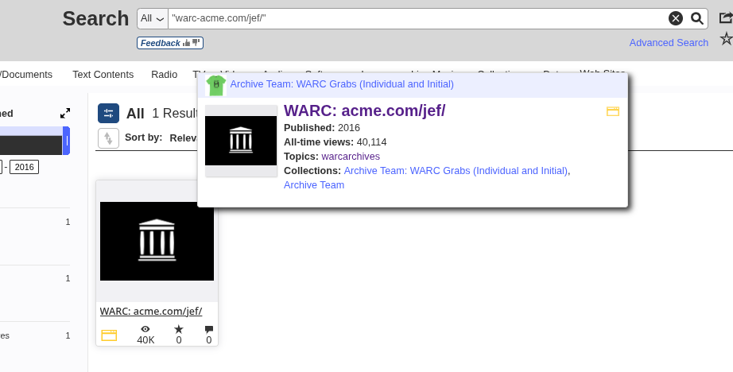
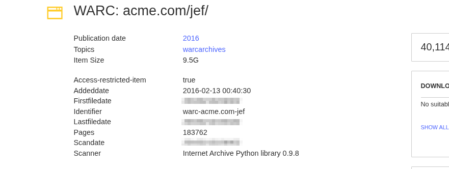
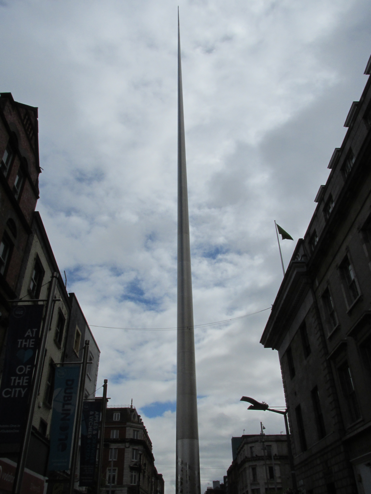
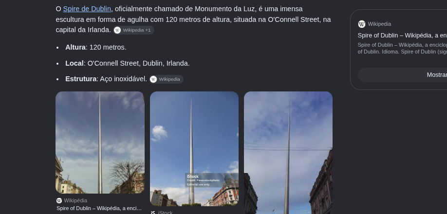
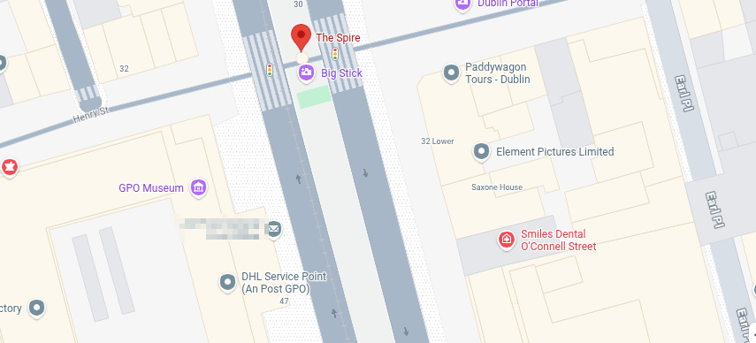
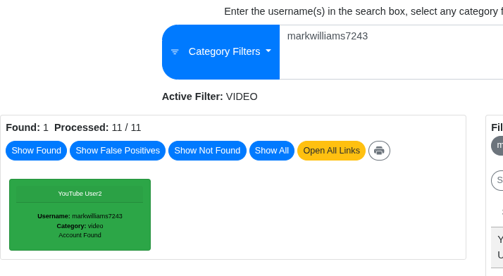
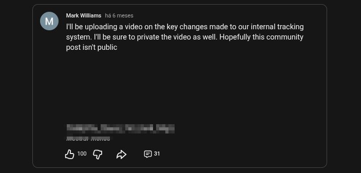

# Digital Footprint (TryHackMe)

O objetivo deste write-up é documentar todo o processo de investigação da empresa fictícia ACME Jet Solutions, proposto no room [Digital Footprint](https://tryhackme.com/room/osintchallengeiv) do TryHackMe, de forma a capturar todas as flags.

## Índice

- [Task 1. The Leaked Photo (A Foto Vazada)](#task-1-the-leaked-photo-a-foto-vazada)
- [Task 2. Archived Company Website (Site Arquivado da Empresa)](#task-2-archived-company-website-site-arquivado-da-empresa)
- [Task 3. Mysterious Landmark (Marco Misterioso)](#task-3-mysterious-landmark-marco-misterioso)
- [Task 4. Internal Documents (Documentos Internos)](#task-4-internal-documents-documentos-internos)
- [Conclusão](#conclusão)

## Task 1. The Leaked Photo (A Foto Vazada)

Nossa primeira tarefa é descobrir onde a seguinte foto (o primeiro arquivo a ser investigado) foi tirada.



Uma rápida olhada na imagem revela alguns elementos de interesse: uma casa de dois pavimentos, com o nome "The Rectory" no portão, grade de ferro e um adesivo "ADT Armed Response". O estilo arquitetônico, a vegetação e, fundamentalmente, a busca pelo referido serviço de segurança privada nos levam à África do Sul, o que é confirmado por uma rápida análise de metadados (ExifTool):

```console
└──╼ $exiftool edited-house-1763031553617.jpg
ExifTool Version Number         : 13.25
File Name                       : edited-house-1763031553617.jpg
Directory                       : .
File Size                       : 793 kB
File Modification Date/Time     : 2026:08:23 17:28:21-03:00
File Access Date/Time           : 2026:10:03 13:41:41-03:00
File Inode Change Date/Time     : 2026:08:23 17:32:05-03:00
File Permissions                : -rw-rw-r--
File Type                       : JPEG
File Type Extension             : jpg
MIME Type                       : image/jpeg
Exif Byte Order                 : Big-endian (Motorola, MM)
GPS Latitude                    : 26 deg 12' 14.76"
GPS Longitude                   : 28 deg 2' 50.28"
JFIF Version                    : 1.01
Resolution Unit                 : None
X Resolution                    : 1
Y Resolution                    : 1
Image Width                     : 1306
Image Height                    : 837
Encoding Process                : Baseline DCT, Huffman coding
Bits Per Sample                 : 8
Color Components                : 3
Y Cb Cr Sub Sampling            : YCbCr4:4:4 (1 1)
Image Size                      : 1306x837
Megapixels                      : 1.1
GPS Position                    : 26 deg 12' 14.76", 28 deg 2' 50.28"

```

Uma segunda análise (FotoForensics), em busca de dados ou informações adicionais, resultou em uma saída semelhante. As coordenadas da imagem nos levam a uma cidade. Temos a primeira flag!



Em determinado momento, na busca por essas coordenadas, fui parar no meio de um deserto. Trata-se, simplesmente, de um erro de formatação (ou seria uma maneira de nos despistar?).

## Task 2. Archived Company Website (Site Arquivado da Empresa)

Por se tratar de uma empresa fictícia, ela não possui site ativo nem informações minimamente relevantes que possam ser encontradas com simples Google Dorks, por exemplo. Não há nada, ou muito pouco, sobre ACME Jet Solutions, ACME, Jet Solutions ou a URL informada (`warc-acme.com/jef/`), nem mesmo no Wayback Machine. A menos que se procure no lugar certo.

No Internet Archive, um arquivo [.WARC](https://en.wikipedia.org/wiki/WARC_%28file_format%29) pôde ser encontrado: uma versão antiga do site, com alguns dados, data e hora. Capturamos, então, a segunda flag.





## Task 3. Mysterious Landmark (Marco Misterioso)

A pesquisa reversa da imagem a seguir, realizada no Google Search, trouxe informações sobre o Spire of Dublin. Esse é o marco misterioso.





Com o nome e a localização do monumento em mãos, o edifício à sua direita foi identificado via Google Maps, obtendo-se, assim, a terceira flag. A saída do ExifTool não trouxe nada relevante ao escopo deste room, apesar da grande quantidade de metadados existentes. Não há coordenadas.



## Task 4. Internal Documents (Documentos Internos)

Por último, a análise de um arquivo .ODT vazado da Jet Solutions: um changelog curto, de Mark para Robin, referente à manutenção de um dos sistemas, apontando otimizações e melhorias internas:

```text
From: Mark
To: Robin

This document outlines recent updates made to the internal tracking system. I will be releasing a video very soon, I implore everyone to watch it!

There have been multiple improvements we’ve made:
- Optimised database queries
- Improved user authentication logging
- Minor bug fixes across the platform
- More fixes mentioned but they’d be too long to list

All developers are reminded not to share interal documentation externally.

```

Dois dados nos são relevantes aqui: uma _description_ direcionada a Robin e um _Internal Username_, `markwilliams7243`, obtido por meio da análise dos metadados. Com o uso do Sherlock, obtivemos algum retorno, mas foi a ferramenta WhatsMyName Web que trouxe o melhor resultado: uma conta ativa no YouTube, de Mark Williams, que continha a última flag que procurávamos.





## Conclusão

Este foi um room bem tranquilo e, como a própria descrição sugere, fácil de concluir, indo da análise dos elementos de interesse das imagens disponibilizadas até os seus metadados. Vê-se daí a importância da devida sanitização dos arquivos que disponibilizamos a terceiros ou que postamos em qualquer rede social, já que a mais simples das imagens pode pôr em xeque elementos tão caros quanto a privacidade e a segurança pessoal. Não menos importante é o cuidado com a exposição de informações sensíveis ou com publicações indevidas, por quaisquer meios.

-   **Ferramentas utilizadas:** ExifTool; FotoForensics; Google Search/Maps; Wayback Machine / Internet Archive; Sherlock; WhatsMyName Web.
-   **Técnicas:** OSINT; análise de metadados EXIF; GEOINT/geolocalização; pesquisa reversa de imagens; análise de sites arquivados (WARC); enumeração de usernames.
-   **Vulnerabilidades e/ou falhas encontradas:** vazamento de metadados EXIF/GPS; exposição de informações internas (_data leakage_); ameaça interna (_insider threat_); falta de sanitização de documentos; publicação indevida em redes sociais; reutilização de usernames em serviços públicos.
