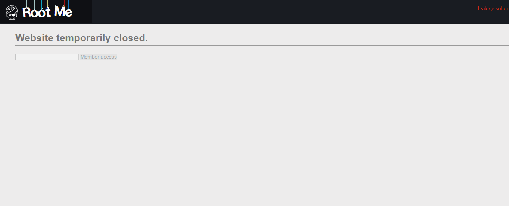
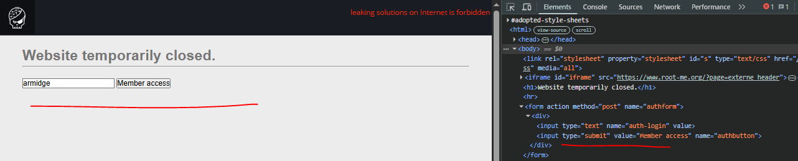

# HTML - disabled buttons / [root-me]

O objetivo [deste desafio](https://www.root-me.org/en/Challenges/Web-Client/HTML-disabled-buttons) é encontrar uma forma de utilizar um formulário desativado para a obtenção de uma flag.

### Índice
1. [Conferindo o código fonte](#conferindo-o-código-fonte)
2. [Conclusão](#conclusão)

## Conferindo o código fonte

Esse é o formulário que precisamos ativar (ou arrumar um jeito de contornar) para conseguir a flag, e o primeiro passo é, pra variar, ver o código-fonte.



```html
<html>
    <head>
        <title>Under construction</title>
        <link rel='stylesheet' property='stylesheet' type='text/css' href='style.css' media='all' />
    </head>
    <body>
        <link rel='stylesheet' property='stylesheet' id='s' type='text/css' href='/template/s.css' media='all' />
        <iframe id='iframe' src='https://www.root-me.org/?page=externe_header'></iframe>
        <h1>Website temporarily closed.</h1>
        <hr>
        <form action="" method="post" name="authform">
            <div>
                <input disabled type="text" name="auth-login" value="" />
                <input disabled type="submit" value="Member access" name="authbutton" />
            </div>
        </form>
    </body>
</html>
```

Uma vista rápida desse código já nos revela o que é, de certo, a solução desse desafio: os inputs desse formulário são totalmente client-side e podem ser alterados/manipulados sem esforço, diretamente pelo Developer Tools.

Na prática, basta a remoção dos dois atributos `disabled` para a ativação do formulário.



E, dessa forma, obtemos a flag. Desafio concluído.

## Conclusão

O que temos aqui é, fundamentalmente, um erro de design e de controle de acesso/autorização, já que não há quaisquer medidas de segurança reais nesse formulário, que, como vimos, pode ser acessado e manipulado com muita facilidade.

- **Ferramentas utilizadas:** Navegador (Developer Tools).
- **Técnicas:** Inspeção de código-fonte.
- **Vulnerabilidades e/ou falhas encontradas:** Broken Access Control (CWE-602) e Information Disclosure.
